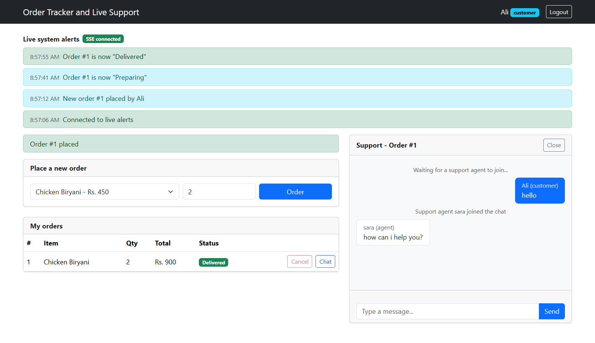
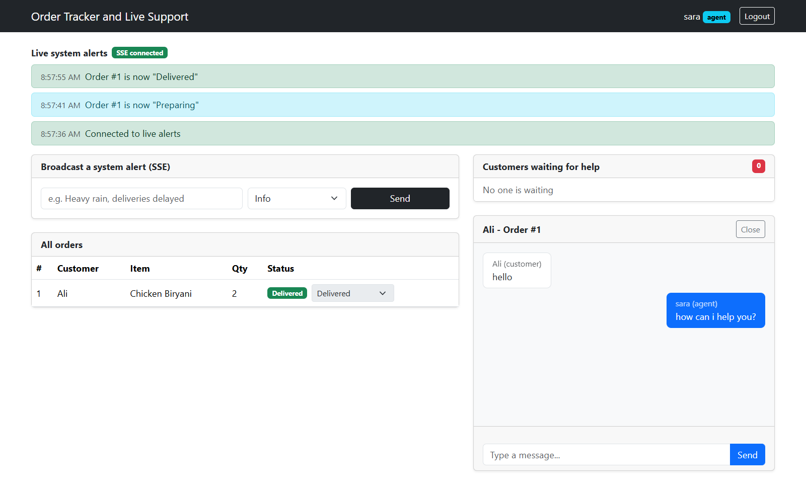

# Order Tracking & Live Support System

A full-stack application demonstrating four communication protocols in one project:

- REST API
- WebSockets using Socket.io
- JSON-RPC 2.0
- Server-Sent Events (SSE)

## Live Demo

- **Live Frontend:** To be added after deployment
- **Live Backend:** To be added after deployment

## Tech Stack

- Backend: Node.js, Express.js, Socket.io
- Database: MySQL
- Frontend: React, Vite, Bootstrap 5

## Features

| Protocol | Endpoint / Technology | Used For |
|---|---|---|
| REST | `/api/v1/catalog` | Product/catalog data |
| REST | `/api/v1/orders` | Order management |
| WebSocket | Socket.io | Live order updates and support chat |
| JSON-RPC 2.0 | `POST /rpc` | Order actions |
| SSE | `GET /events` | Live system alerts |

## REST API

| Method | Endpoint | Description |
|---|---|---|
| GET | `/api/v1/catalog` | Get products |
| GET | `/api/v1/orders` | Get orders |
| GET | `/api/v1/orders/:id` | Get one order |
| POST | `/api/v1/orders` | Create an order |
| PATCH | `/api/v1/orders/:id/status` | Update order status |
| POST | `/api/v1/alerts` | Send SSE alert |

## JSON-RPC 2.0

Endpoint:

`POST /rpc`

Available methods:

- `listMethods`
- `getOrderStatus`
- `cancelOrder`

Example:

```json
{
  "jsonrpc": "2.0",
  "method": "cancelOrder",
  "params": {
    "orderId": 1
  },
  "id": 1
}
```

## Server-Sent Events

Endpoint:

`GET /events`

SSE is used for live system alerts.

Example:

```json
{
  "message": "New alert",
  "level": "info",
  "time": "2026-09-30T10:00:00"
}
```

# WebSocket Events

## Client to Server

| Event | Payload | Description |
|---|---|---|
| `customer:online` | `{ name }` | Customer joins their private update room |
| `agent:online` | `{ name }` | Agent joins agents room |
| `support:request` | `{ orderId, customerName }` | Customer requests support |
| `chat:join` | `{ room, name }` | Agent joins chat |
| `chat:message` | `{ room, text }` | Sends chat message |
| `chat:typing` | `{ room }` | Typing indicator |
| `chat:leave` | `{ room }` | Leaves chat |

## Server to Client

| Event | Payload | Description |
|---|---|---|
| `order:created` | order | New order notification |
| `order:statusUpdated` | order | Order status update |
| `agent:ready` | `{ openRequests }` | Open support requests |
| `support:newRequest` | support request | New support request |
| `support:removed` | `{ room }` | Support request removed |
| `chat:joined` | `{ room, history }` | Chat joined |
| `chat:message` | message | New chat message |
| `chat:system` | `{ room, text }` | System message |
| `chat:typing` | `{ room, name }` | Typing indicator |
| `chat:error` | string | Chat error |

## Chat Rooms

Chat rooms follow this format:

`support-order-<orderId>`

Each room supports:

- 1 customer
- 1 support agent

## Screenshots

### Customer Dashboard



### Support Agent Dashboard



### Live Support Chat


### Order Tracking


## Local Setup

### Backend

```bash
cd backend
npm install
npm run dev
```

### Frontend

```bash
cd frontend
npm install
npm run dev
```

Open:

`http://localhost:5173`

## Project Structure

```text
order-tracker/
│
├── backend/
├── frontend/
├── screenshots/
├── .gitignore
└── README.md
```

## Deployment

- Frontend: Vercel
- Backend: Railway
- Database: MySQL